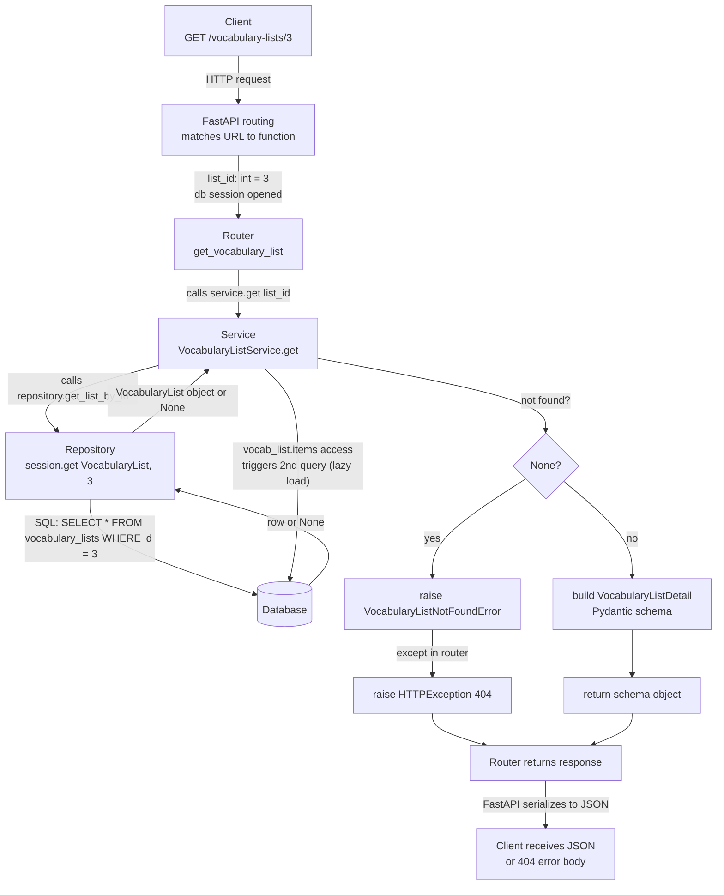

# Architecture

## Purpose

AI Chinese Story Generator helps a learner practise Chinese through short,
personalised stories built around vocabulary they already know. The
application imports a learner's vocabulary from Skritter, stores it
reliably, and uses that vocabulary to generate and present reading
material.

## System boundaries

Single deployable backend (a modular monolith) plus a separate Next.js
frontend that talks only to the backend API — never directly to
PostgreSQL. See [CLAUDE.md](../CLAUDE.md) for the module breakdown and the
router → service → repository layering each module follows.

External systems, kept at explicit boundaries:

- **Skritter API** — source of a learner's vocabulary (`ingestion` module).
- **OpenAI-compatible provider** — story generation, behind a
  provider-neutral interface with an explicit allowlist of reviewed
  `(label, model, base_url)` combinations (`generation/providers/`).
- **PostgreSQL** — system of record for vocabulary, sync history, and
  stories.

Future infrastructure (Airflow, BigQuery, etc.) is tracked on the
[GitHub Project board](https://github.com/users/jack93g/projects/1), not here.

## Data flow

1. `sync-skritter` (run daily by cron on the Droplet) requests vocabulary
   from the Skritter API and records a `sync_run`. Only words not already
   stored are fetched unless `--refresh` is passed. Raw responses are kept as
   `raw_skritter_payloads` for the most recent runs, for debugging.
2. The `vocabulary` module normalises valid records into `vocabulary_items`
   and their `vocabulary_lists`/`list_vocabulary` membership. Membership
   mirrors Skritter: removed words are unlinked, and lists deleted in Skritter
   are archived rather than deleted, because stories and requests refer to them.
3. A story request is queued (`story_generation_requests`, status
   `queued`). The `generation` worker claims it, selects a random sample
   of known vocabulary, and calls the allowlisted provider.
4. The worker moves the request through `queued → running →
   succeeded|failed` (up to 3 attempts), persisting the generated story and
   its `story_vocabulary_items`, with provider payloads redacted before
   storage. From `story-v7` the story carries comprehension questions,
   stored with their options shuffled.
5. The frontend fetches saved stories and vocabulary metadata via the API
   and lets the learner reveal or hide reading aids.
6. The learner answers the story's questions. The API holds the answer
   keys, marks each attempt, and records it in `quiz_attempts`; a report of
   a question that seems wrong goes to `question_flags`. Both keep the
   logged-in user, and `manage-questions` reads them back for review.
7. Logging in and out is recorded in `auth_events`: the outcome
   (`login_succeeded`, `login_wrong_password`, `login_unknown_user`,
   `logout`), the user and session where there is one, and the client IP and
   user agent. Attempts refused by the rate limiter aren't recorded, and an
   unknown username is never stored. Rows are deleted after 90 days.

## Request flow example: `GET /vocabulary-lists/{list_id}`

Trace of a single request through the layering, using
`GET /vocabulary-lists/3` (list `3` has 2 vocabulary items):

| Stage | Plain English | Code |
|---|---|---|
| 1. Client sends request | Something (browser, `/docs`, `curl`) sends a plain-text HTTP message. Nothing in the codebase has run yet. | — |
| 2. FastAPI matches the URL | FastAPI matches `/vocabulary-lists/3` to `{list_id}`, converting `"3"` to the Python `int` `3`. `Depends(get_db)` opens a fresh DB session for this request. | `story_generator/api/dependencies.py` — `get_db()` |
| 3. Router hands off to service | The router only translates HTTP ↔ Python, so it delegates immediately. | `get_vocabulary_list(list_id, db)` in the vocabulary router |
| 4. Service asks repository for raw data | The service knows the business question ("find list 3, and I need it or a clear failure") but not SQL. | `VocabularyListService.get()` → `self.repository.get_list_by_id(list_id)` |
| 5. Repository talks to the database | The only layer allowed to speak SQL. It treats an archived (deleted in Skritter) or hidden list as missing. | `VocabularyRepository.get_list_by_id()` → `self.session.get(VocabularyList, list_id)` → `SELECT * FROM vocabulary_lists WHERE id = 3`, then `None` unless `is_available` (not archived or hidden) |
| 6. Service repackages the result | Raises a domain error (not found) or builds the public `VocabularyListDetail` schema. Accessing `vocab_list.items` here triggers a *second*, lazy-loaded query for the list's items. | `VocabularyListService.get()` |
| 7. Router turns the result into HTTP | A schema is auto-serialized to JSON (`response_model=VocabularyListDetail`); a caught `VocabularyListNotFoundError` becomes `HTTPException(404, ...)`. | vocabulary router |
| 8. Client receives JSON | The list + items as JSON, or a `404` with an error `detail`. | — |

The core idea: at every stage the *shape* of the data changes — URL string
→ Python `int` → SQLAlchemy model → Pydantic schema → JSON — and each layer
only ever touches its immediate neighbors' shapes (router ↔ HTTP/Python,
service ↔ Python/business rules, repository ↔ SQL/ORM).
