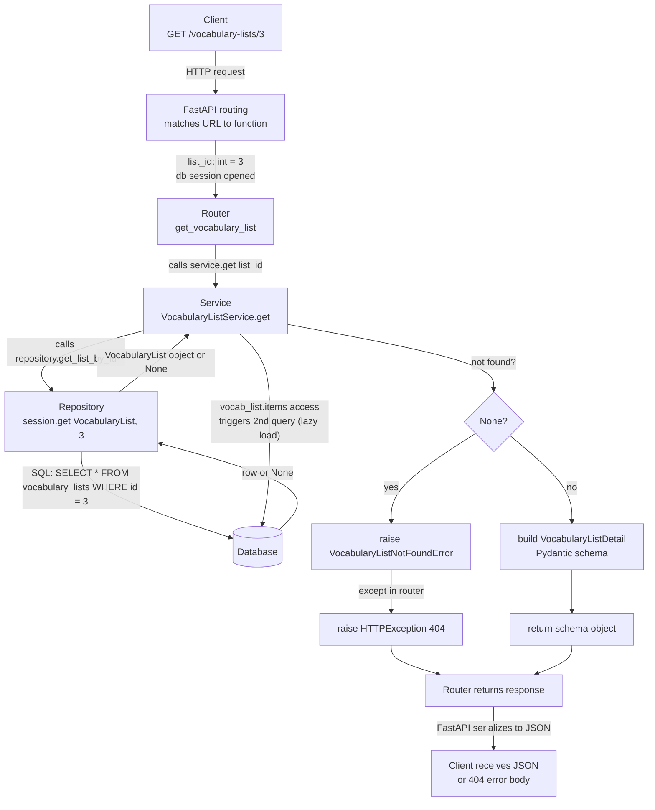

# Request flow: `GET /vocabulary-lists/{list_id}`

End-to-end trace of a single request, from client to database and back, using
`GET /vocabulary-lists/3` as the concrete example (list `3` has 2 vocabulary items).

## Flowchart

## Stage-by-stage

| Stage | Plain English | Code |
|---|---|---|
| 1. Client sends request | Something (browser, `/docs`, `curl`) sends a plain-text HTTP message: "give me whatever's at this URL." Nothing in the codebase has run yet. | — |
| 2. FastAPI matches the URL | FastAPI compares `/vocabulary-lists/3` against every registered route pattern until it finds `{list_id}` matches `3`, converting the text `"3"` into the Python `int` `3`. `Depends(get_db)` opens a fresh DB session for this one request. | `story_generator/api/dependencies.py` — `get_db()` |
| 3. Router hands off to service | The router's only job is translating between HTTP and Python — it doesn't know how to fetch data itself, so it delegates immediately. | `get_vocabulary_list(list_id, db)` in the vocabulary router |
| 4. Service asks repository for raw data | The service knows the business question ("find list 3, and I need it or a clear failure") but not SQL, so it asks the repository. | `VocabularyListService.get()` calling `self.repository.get_list_by_id(list_id)` |
| 5. Repository talks to the database | The only layer allowed to speak SQL. Turns "get list 3" into an actual query. | `VocabularyRepository.get_list_by_id()` → `self.session.get(VocabularyList, list_id)` → `SELECT * FROM vocabulary_lists WHERE id = 3` |
| 6. Service repackages the result | The service takes the raw SQLAlchemy row and either raises a domain error (not found) or builds the public `VocabularyListDetail` schema. Accessing `vocab_list.items` here silently triggers a *second* query (lazy loading) to fetch the list's vocabulary items. | `VocabularyListService.get()` — `raise VocabularyListNotFoundError` or `return VocabularyListDetail(...)` |
| 7. Router turns the result into HTTP | A returned schema gets auto-serialized to JSON by FastAPI (`response_model=VocabularyListDetail`). A caught `VocabularyListNotFoundError` gets turned into `HTTPException(status_code=404, ...)`. | `except VocabularyListNotFoundError: raise HTTPException(...)` in the router |
| 8. Client receives JSON | The browser/`/docs`/`curl` gets back either the list + items as JSON, or a `404` with an error `detail` message. | — |

## The core idea

At every stage the *shape* of the data changes — URL string → Python `int` →
SQLAlchemy model object → Pydantic schema object → JSON text — and each layer
only ever touches its immediate neighbors' shapes:

- **Router** ↔ HTTP and Python primitives. No SQL.
- **Service** ↔ Python objects and business rules. No HTTP, no SQL.
- **Repository** ↔ SQL and ORM objects. No business rules, no HTTP.